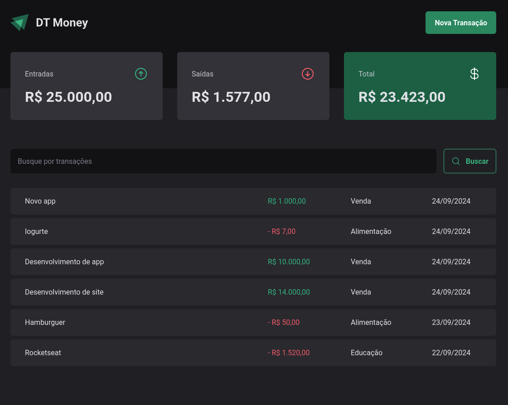
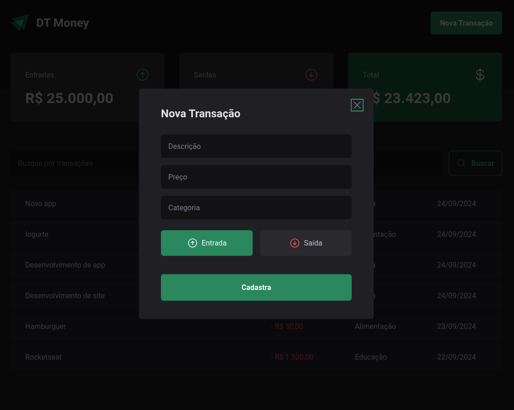

# DT Money

## Tecnologias Aprendidas

Neste projeto, eu pude aprender e aplicar as seguintes tecnologias e conceitos:

- Acessibilidade em aplicações web
- Implementação de modais
- Requisições HTTP e conexão com API
- Gerenciamento de estados via Contexto do React
- Otimização e performance em aplicações React

## Imagens do Projeto

